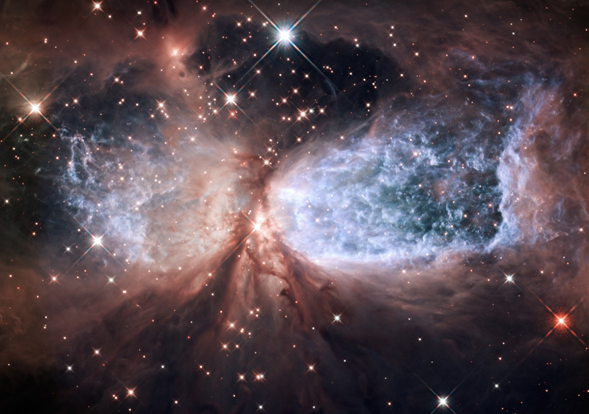

+++
date = '2026-02-23T17:24:00+08:00'
draft = false
title = 'What Did Hubble See on Your Birthday?'
tags = ["随思随想"]
+++

The Hubble Space Telescope captured this image on my birthday in a certain year. The star-forming region, called Sharpless 2-106, looks like a celestial angel. The "wings" of the nebula are twin lobes of hot gas that stretch outward from a massive, young star near the center of the image. In this boundless cosmos, what was going through my mind back then? 